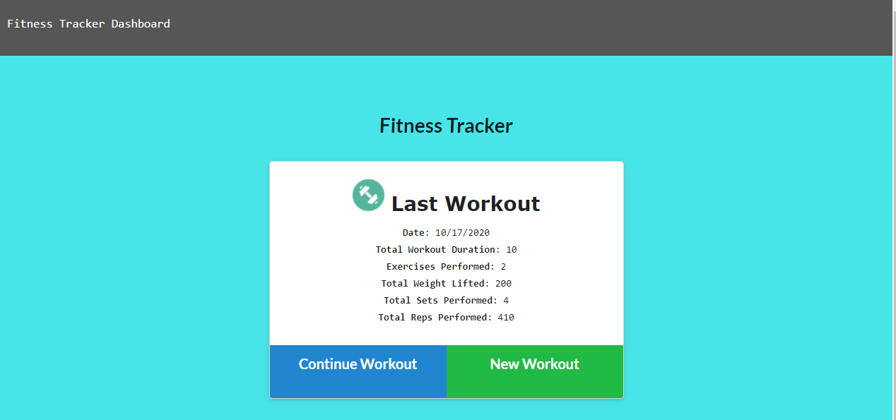

  
# Exercise Tracker

## Description 
The purpose of the project is to create an exercise tracker, so users can track their fitness goals and see it represented graphically. 

## Project Demonstration
  

## Table of contents

- [Description](#description)
- [Installation](#installation)
- [Usage](#usage)
- [License](#license)
- [Contributing](#contributing)
- [Questions](#questions)
- [Repository Link](#repository)

## Installation

        Open up heroku link here >https://github.com/KJ-Labs/Exercise_Tracker 

## Usage

        Select the type of workout and fill out the details, then hit add exercise and wait for it to be added to the database witha success message that pops in from the top right, then hit complete. Click in the top left to go to the stats page. 

## License
MIT 

2020 Permission is hereby granted, free of charge, to any person obtaining a copy of this software and associated documentation files (the Software), to deal in the Software without restriction, including without limitation the rights to use, copy, modify, merge, publish, distribute, sublicense, and/or sell copies of the Software, and to permit persons to whom the Software is furnished to do so, subject to the following conditions:The above copyright notice and this permission notice shall be included in all copies or substantial portions of the Software.THE SOFTWARE IS PROVIDED AS IS, WITHOUT WARRANTY OF ANY KIND, EXPRESS OR IMPLIED, INCLUDING BUT NOT LIMITED TO THE WARRANTIES OF MERCHANTABILITY, FITNESS FOR A PARTICULAR PURPOSE AND NONINFRINGEMENT. IN NO EVENT SHALL THE AUTHORS OR COPYRIGHT HOLDERS BE LIABLE FOR ANY CLAIM, DAMAGES OR OTHER LIABILITY, WHETHER IN AN ACTION OF CONTRACT, TORT OR OTHERWISE, ARISING FROM, OUT OF OR IN CONNECTION WITH THE SOFTWARE OR THE USE OR OTHER DEALINGS IN THE SOFTWARE.

## Contributing

kj-labs

## Questions

- If you have any questions, please contact me on Github.
- undefined
- [KJ-Labs](https://github.com/KJ-Labs)

## Repository

- [Project Repo](https://github.com/KJ-Labs/Exercise_Tracker)

## Screenshots
  

